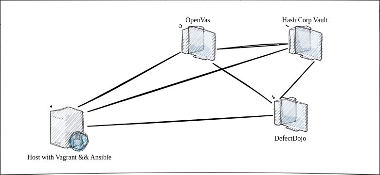
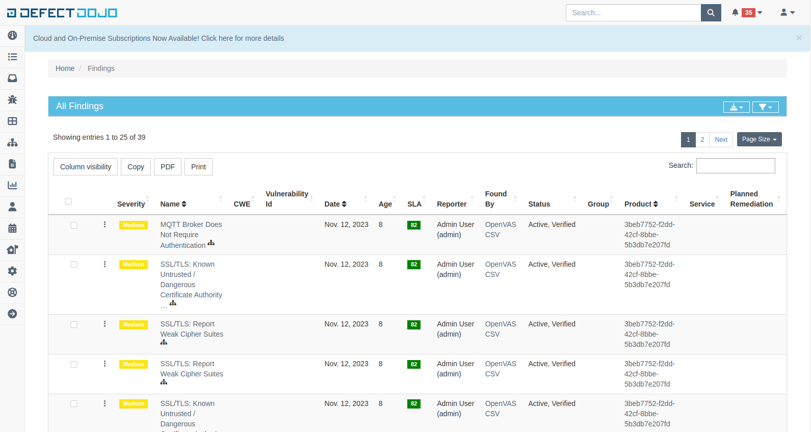

## Vagrant + Ansible + HashiCorp Vault + OpenVAS + DefectDojo secure infrastructure

Deploy **OpenVAS** on hardened Debian server into a virtual machine with **Vagrant** using *Ansible*. <br/>
Aggregate scan results findings in **DefectDojo**. <br/>
Store all secrets in **Vault**.



### 1. Vagrant stage

You need 3 virtual machines running Debian/bullseye64:

One for Vault.
One for OpenVas (preferably allocate around 30 GB of disk space).
One for DefectDojo.

Run `vagrant up` to start the virtual machines.

<details>
  <summary> Port forwarding configuration is used for debugging purposes, allowing access to specific services (Vault, OpenVAS, DefectDojo) on the guest machine from the host machine, it can be removed if not needed.</summary>

```
n.vm.network "forwarded_port", guest: 8201, host: "#{8200+machine_id}", id: "http1" # vault debug port for host
n.vm.network "forwarded_port", guest: 9392, host: "#{9440+machine_id}", id: "http2" # openvas debug port for host
n.vm.network "forwarded_port", guest: 8080, host: "#{8080+machine_id}", id: "https" # defectdogo debug port for host
```

To connect to the virtual machines created with Vagrant, it is essential to generate an SSH key pair using ssh-keygen on the host machine and then include the public key in the Vagrantfile to distribute it to the deployed instances. The script responsible for sending the keys is located in `add_ans_user.sh`.

</details>

### 2. Ansible stage

<details>
  <summary>Before running ansible-playbook, let's increase the memory for the machine with OpenVAS.</summary>

To do this, connect to it via SSH:

```
sudo ssh ans_user@127.0.0.1 -p 2001 -i keys
```
Then, execute the following command:

```
sudo resize2fs -p -F /dev/sda1
```
</details>

Run `ansible-playbook site.yaml -i hosts -D -vv` to execute the Ansible playbook using the provided inventory file hosts with increased verbosity (`-vv`). <br/>This command will initiate the deployment and configuration tasks specified in your Ansible playbook (`site.yaml`). The debug (`-D`) option will display additional debugging information during execution.

Ansible tasks in more detail:

* **Install Docker and Apply High Hardening:**

This task, executed on all hosts, installs Docker and applies security hardening measures.

* **Install Vault**

Executed on hosts designated as "vault_server," this task installs HashiCorp Vault for secure secrets management.

* **Install OpenVAS**

This task, executed on hosts designated as "openvas_server," installs and configures OpenVAS for vulnerability scanning.

Warning!
I waited for over 2 hours during the loading of scanning configurations. If you encounter the "The SCAP database is required" error, please refer to this [forum post](https://forum.greenbone.net/t/missing-scan-configuration/12296) for assistance.

* **Install DefectDojo**

Executed on hosts designated as "defectdojo_server," this task installs DefectDojo for managing application security testing results.


### 3. Manual Vault setting stage

Next, we need manual configuration of VAULT. For greater security, it is better to do this manually.

`export VAULT_ADDR=http://0.0.0.0:8201`

This command will initialize Vault and provide you with unseal keys and an initial root token. Make sure to securely save these keys as they are essential for unsealing the Vault in case it gets sealed:

* `vault operator init`
* `vault operator unseal` - use 3/5 keys
* `vault login` - use 1 root token
* `vault secrets enable -path=ansible/storage kv`  - create storage
* `vault kv put ansible/storage/defectdojo login=admin password=$PASSWORD1 token=null` - add your new credentials for DefectDojo
* `vault kv put ansible/storage/openvas login=admin password=$PASSWORD2` - add your new credentials for OpenVAS

*   ```
    vault policy write my-policy - << EOF
    path "ansible/storage/*" {
    capabilities = ["read","list","create","update"]
    }
    EOF
    ```
* `vault token create -policy=my-policy`  - create your special ansible_token for Ansible or use the root token (not recommended)

### 4. OpenVAS scanning stage

Start OpenVAS scan and send report to the DefectDojo:

`ansible-playbook scan-playbook.yaml -i hosts -D -e "token=ansible_token"`

### 5. Checking the results in DefectDojo stage

Go to the http://127.0.0.1:8082 and check:


